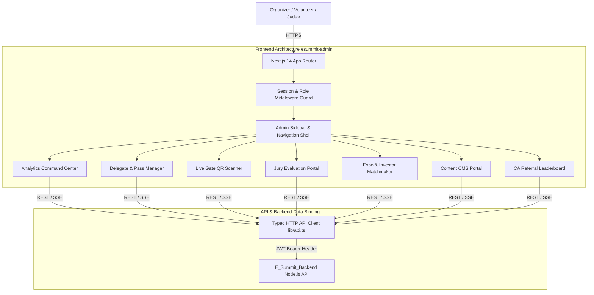
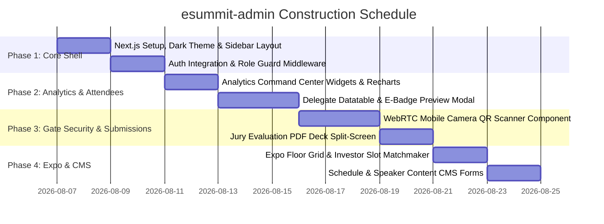

# Next.js Admin Dashboard Implementation Plan (`esummit-admin`)

## 1. Executive Summary & Operational Context

### 1.1 Context
This document specifies the technical implementation plan for **`esummit-admin`**, the dedicated executive command center and volunteer operations portal for **PEC Summit 2026**.

While the primary public website (`ESUMMIT`) serves delegates and attendees, **`esummit-admin`** enables organizers, gatekeepers, judges, and investors to manage live registrations, verify cryptographic QR passes at entry gates, grade hackathon & pitch competition submissions, allocate expo stalls, and update event schedules in real-time.

### 1.2 Access Control & Persona Matrix

| User Role | Accessible Dashboard Modules | Operational Objectives |
| :--- | :--- | :--- |
| **`SUPER_ADMIN`** | Full System Access (All Modules + User Management) | Executive oversight, total revenue audit, system configuration |
| **`ORGANIZER`** | Analytics, Delegates, Jury, Expo, CMS, CA Leaderboard | Event management, attendee support, schedule updates |
| **`VOLUNTEER_CHECKIN`** | Live Mobile Gate QR Scanner & Manual Attendee Lookup | Fast entry check-in scanning at campus gates |
| **`INVESTOR` / Judge** | Pitch & Hackathon Submission Evaluator + Slot Matchmaker | Review pitch decks, grade entries, book 15-min slots |

---

## 2. High-Level Architecture & Tech Stack



---

## 3. Core Dashboard Modules Breakdown

### 3.1 Module 1: Executive Command Center & Analytics Dashboard
- **Live Counter Widgets**:
  - Total Delegates Registered vs Target (3,000+).
  - Total Revenue Collected (Breakdown: General ₹0, Founder ₹799, Hacker ₹199).
  - Live Gate Check-ins (Real-time count on Day 1 & Day 2).
  - Active Hackathon & Pitch Teams.
- **Data Visualizations (Recharts)**:
  - **Registration Velocity Line Chart**: Cumulative and daily signup trajectory.
  - **Track Distribution Pie Chart**: Breakdown across Pitch, Hackathon, Expo, and Panels.
  - **College Representation Bar Chart**: Top participating institutions (PEC, IIT Ropar, PU, Chitkara, etc.).
- **Live Check-in Audit Stream**: Real-time ticker showing recent attendee gate scans.

### 3.2 Module 2: Delegate & E-Badge Operations Manager
- **Server-Paginated Datatable**:
  - Multi-field search (Name, Email, Phone, College, Pass ID `PEC-XXXXXX`).
  - Status filters: Pass Type (`Student`, `Founder`, `Hacker`, `CA`), Payment Status (`Paid`, `Pending`), Gate Check-in Status (`Checked In`, `Not Checked In`).
- **Interactive E-Badge Drawer**:
  - Visual preview of digital delegate card.
  - One-click PDF Badge re-issue and email resend capability.
  - Manual override toggle (e.g. emergency VIP badge activation).
- **Data Export Engine**: Export filtered delegate lists to CSV/Excel for security personnel and hostel accommodation teams.

### 3.3 Module 3: Live Mobile Gate QR Scanner (Volunteer View)
- **WebRTC Camera Scanner**:
  - Integrated camera view supporting mobile web browsers on smartphones/tablets.
  - Automatically captures QR frames and pings `POST /api/v1/checkin/verify-qr`.
- **Instant Audio-Visual Feedback**:
  - **Valid Ticket**: Neon green flash screen + high-pitch success chime. Displays delegate name, college, and pass tier.
  - **Invalid / Duplicate Ticket**: Crimson red flash screen + error alarm tone. Displays previous check-in timestamp and gate location to prevent pass reuse.
- **Manual Search Fallback**: Quick lookup search box for manual check-in when delegate's phone screen is damaged.

### 3.4 Module 4: Pitch & Hackathon Jury Evaluator
- **Jury Evaluation Workspace**:
  - Side-by-side split screen: Left side embedded PDF Pitch Deck viewer / GitHub repo link; Right side scoring rubric sliders.
- **Numeric Scoring Rubric (1-10 Scale)**:
  - Innovation & Problem Scope (1-10)
  - Technical Execution & MVP (1-10)
  - Market Size & GTM Viability (1-10)
  - Presentation & Pitch Delivery (1-10)
- **Live Leaderboard**: Real-time aggregated team scores sorted by total points.

### 3.5 Module 5: Startup Expo & Investor Matchmaker
- **Interactive Floor Grid Matrix**:
  - Visual map showing 30+ Startup Expo booths on campus.
  - Drag-and-drop stall assignment tool pairing verified startups with booth numbers (`Booth #01` to `Booth #30`).
- **Investor Open Hours Booking Engine**:
  - Matrix of 15-minute slots (10:00 AM - 4:00 PM).
  - Matches registered investor profiles with pitching startup founders.

### 3.6 Module 6: Content & Schedule CMS
- **Schedule Builder**:
  - CRUD interface for Day 1 & Day 2 event schedules.
  - Fields: Title, Type (keynote, panel, competition, hackathon), Track tag, Start Time, End Time, Venue, Speaker assignments.
- **Speaker & Sponsor Management**:
  - Add/edit speakers (Name, Title, Bio, Track, Avatar upload).
  - Add/edit sponsors (Tier, Name, Logo upload, Website link).

### 3.7 Module 7: Campus Ambassador (CA) Leaderboard
- **Referral Tracking**:
  - Leaderboard ranking CAs by confirmed delegate signups generated through their unique referral code (`CA-PEC-XXX`).
  - Tier rewards marker (Gold, Silver, Bronze CA certificates & VIP Summit passes).

---

## 4. UI Design System & Aesthetic Tokens

```css
/* Color Palette tailored for E-Summit Fintech/Money Theme */
:root {
  --bg-pitch-black: #070B08;
  --bg-panel-dark: #0D140E;
  --border-neon-green: rgba(126, 211, 33, 0.2);
  --accent-neon-green: #7ED321;
  --text-primary: #F5F5F0;
  --text-muted: #8A9488;
}
```

---

## 5. API Integration & State Management (`lib/api.ts`)

- **Typed HTTP Client**: Built using `fetch` wrapper with automatic JWT header injection (`Authorization: Bearer <token>`).
- **Auto Refresh Mechanism**: Intercepts 401 Unauthorized responses and calls `/api/v1/auth/refresh` to renew session seamlessly.
- **Real-Time Updates**: Uses Server-Sent Events (SSE) / WebSockets for live gate check-in counts and scoreboard updates.

---

## 6. Implementation Roadmap



---
*Created and stored in `/Users/aryansingh/Documents/E-SUMMIT/E_Summit_Backend/ADMIN_DASHBOARD_PLAN.md`.*
