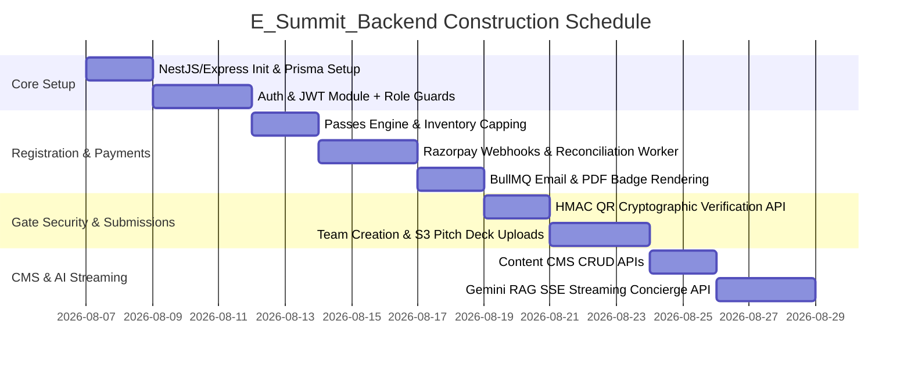

# Production Backend Implementation Plan (`E_Summit_Backend`)

## 1. Executive Summary & Codebase Analysis

### 1.1 Context
This document specifies the technical implementation plan for **`E_Summit_Backend`**, the production-grade API and data engine powering **PEC Summit 2026** (hosted by E-Cell PEC, Chandigarh). 

### 1.2 Analysis of Existing Frontend (`ESUMMIT`)
Through a complete analysis of the `ESUMMIT` Next.js codebase, the following key state items, routes, and client-side mocks were identified that must be replaced by this backend:

| Frontend Feature | Current State in `ESUMMIT` | Backend Replacement Requirement in `E_Summit_Backend` |
| :--- | :--- | :--- |
| **Delegate Registration** | Handled via `localStorage` key `pec_summit_registrations` | PostgreSQL `Registration` & `User` tables with transactional durability & payment binding |
| **Pass Ticketing & QR Codes** | Static URL using external service `api.qrserver.com` | Server-side cryptographic HMAC-SHA256 signed QR tokens (`HMAC-SHA256(userId + passId + secret)`) |
| **Payment Gateway** | Free passes hardcoded, paid passes stubbed | Razorpay Orders API, webhook signature verification (`X-Razorpay-Signature`), and idempotency protection |
| **Concierge AI Agent** | Client-side pattern matcher in `components/Concierge/agent.ts` | Real RAG service using PostgreSQL `pgvector` + Google Gemini 1.5 Flash with SSE response streaming |
| **Newsletter / Updates** | Saved to `localStorage` key `pec_summit_subscribers` | PostgreSQL `Subscriber` model + automated Resend/SendGrid email workflow |
| **Schedule, Speakers, FAQs** | Static arrays in `lib/data.ts` | Dynamic CMS REST APIs allowing real-time edits without redeploying frontend |
| **Team Submissions** | Not persistent | PostgreSQL `Team`, `TeamMember`, and `Submission` tables with S3 PDF deck uploads |

---

## 2. High-Level Architecture & Tech Stack

```mermaid
graph TD
    Client[ESUMMIT Frontend App] -->|HTTPS / WSS| WAF[Cloudflare WAF / Nginx API Gateway]
    Admin[esummit-admin Portal] -->|HTTPS / WSS| WAF
    
    subgraph E_Summit_Backend Node.js / NestJS Engine
        WAF --> RateLimit[Redis Token-Bucket Rate Limiter]
        RateLimit --> AuthGuard[JWT & RBAC Auth Guard]
        
        AuthGuard --> AuthMod[Auth & User Module]
        AuthGuard --> RegMod[Pass & Registration Module]
        AuthGuard --> PayMod[Payment & Reconciliation Module]
        AuthGuard --> GateMod[Cryptographic QR & Gate Check-in Module]
        AuthGuard --> TeamMod[Team & Submission Module]
        AuthGuard --> CMSMod[Schedule & Content CMS Module]
        AuthGuard --> AiMod[AI Concierge RAG Engine]
    end

    subgraph Data Layer
        AuthMod & RegMod & TeamMod & CMSMod --> Postgres[(PostgreSQL Primary DB)]
        GateMod & RateLimit --> Redis[(Redis Cache & Session Store)]
        RegMod & TeamMod --> S3[(AWS S3 - PDF Badges & Decks)]
    end

    subgraph Background Queue (BullMQ)
        RegMod & PayMod --> BullMQ[BullMQ Redis Queue]
        BullMQ --> EmailJob[Resend Email Worker]
        BullMQ --> PDFJob[Puppeteer PDF Badge Worker]
        BullMQ --> AuditJob[Payment Audit Worker]
    end

    subgraph External Services
        PayMod --> Razorpay[Razorpay Gateway]
        AiMod --> Gemini[Google Gemini 1.5 Flash API]
    end
```

---

## 3. Comprehensive Database Schema (Prisma Blueprint)

```prisma
datasource db {
  provider = "postgresql"
  url      = env("DATABASE_URL")
}

generator client {
  provider        = "prisma-client-js"
  previewFeatures = ["postgresqlExtensions"]
}

enum Role {
  SUPER_ADMIN
  ORGANIZER
  VOLUNTEER_CHECKIN
  INVESTOR
  DELEGATE
}

enum PassType {
  STUDENT_GENERAL
  FOUNDER_PITCH
  HACKATHON_BUILDER
  CAMPUS_AMBASSADOR
}

enum PaymentStatus {
  PENDING
  SUCCESS
  FAILED
  REFUNDED
}

enum CompetitionType {
  PITCH_COMPETITION
  HACKATHON
}

model User {
  id            String         @id @default(uuid())
  email         String         @unique
  passwordHash  String?
  name          String
  phone         String?
  college       String?
  gradYear      String?
  city          String?
  role          Role           @default(DELEGATE)
  referralCode  String?        @unique
  referredById  String?
  referredBy    User?          @relation("CAReferrals", fields: [referredById], references: [id])
  referrals     User[]         @relation("CAReferrals")
  registrations Registration[]
  teamMembers   TeamMember[]
  checkIns      CheckIn[]      @relation("AttendeeCheckIns")
  scannedLogs   CheckIn[]      @relation("VolunteerScans")
  createdAt     DateTime       @default(now())
  updatedAt     DateTime       @updatedAt
}

model Registration {
  id            String        @id @default(uuid())
  passId        String        @unique // e.g. PEC-984210
  userId        String
  user          User          @relation(fields: [userId], references: [id], onDelete: Cascade)
  passType      PassType
  amountPaid    Float         @default(0.0)
  qrToken       String        @unique // HMAC Signed Token
  paymentId     String?       @unique
  payment       Payment?      @relation(fields: [paymentId], references: [id])
  tracks        String[]
  isCheckedIn   Boolean       @default(false)
  badgePdfUrl   String?
  createdAt     DateTime      @default(now())
}

model Payment {
  id             String        @id @default(uuid())
  orderId        String        @unique // Razorpay Order ID
  transactionId  String?       @unique
  amount         Float
  currency       String        @default("INR")
  status         PaymentStatus @default(PENDING)
  registration   Registration?
  rawWebhookLog  Json?
  createdAt      DateTime      @default(now())
  updatedAt      DateTime      @updatedAt
}

model Team {
  id           String          @id @default(uuid())
  name         String
  code         String          @unique // e.g. HACK-9A4B
  type         CompetitionType
  trackName    String
  leaderId     String
  members      TeamMember[]
  submission   Submission?
  scores       Score[]
  createdAt    DateTime        @default(now())
}

model TeamMember {
  id        String   @id @default(uuid())
  teamId    String
  team      Team     @relation(fields: [teamId], references: [id], onDelete: Cascade)
  userId    String
  user      User     @relation(fields: [userId], references: [id])
  role      String   @default("MEMBER") // LEADER or MEMBER
  joinedAt  DateTime @default(now())

  @@unique([teamId, userId])
}

model Submission {
  id          String   @id @default(uuid())
  teamId      String   @unique
  team        Team     @relation(fields: [teamId], references: [id], onDelete: Cascade)
  title       String
  description String
  repoUrl     String?
  demoUrl     String?
  deckPdfUrl  String?  // S3 URL
  submittedAt DateTime @default(now())
}

model Score {
  id           String   @id @default(uuid())
  teamId       String
  team         Team     @relation(fields: [teamId], references: [id], onDelete: Cascade)
  judgeId      String
  innovation   Int      // 1-10
  execution    Int      // 1-10
  marketSize   Int      // 1-10
  presentation Int      // 1-10
  comments     String?
  createdAt    DateTime @default(now())

  @@unique([teamId, judgeId])
}

model CheckIn {
  id          String   @id @default(uuid())
  userId      String
  user        User     @relation("AttendeeCheckIns", fields: [userId], references: [id])
  scannedById String
  scannedBy   User     @relation("VolunteerScans", fields: [scannedById], references: [id])
  gateName    String   @default("MAIN_GATE")
  timestamp   DateTime @default(now())
}

model Event {
  id          String   @id @default(uuid())
  title       String
  type        String   // keynote, panel, competition, hackathon, social
  track       String?
  day         Int      // 1 or 2
  startTime   String   // e.g. "10:00"
  endTime     String   // e.g. "11:30"
  venue       String
  speakerIds  String[]
  createdAt   DateTime @default(now())
}

model Speaker {
  id        String   @id @default(uuid())
  name      String
  title     String
  bio       String
  track     String
  avatarUrl String?
  initials  String
  color     String   @default("#7ED321")
}

model Sponsor {
  id        String   @id @default(uuid())
  tier      String   // title, gold, silver, media
  name      String
  logoUrl   String?
  websiteUrl String?
}

model Subscriber {
  id        String   @id @default(uuid())
  email     String   @unique
  createdAt DateTime @default(now())
}
```

---

## 4. API Endpoints Directory & Specifications

### 4.1 Authentication Module (`/api/v1/auth`)
* `POST /api/v1/auth/register` — Standard email & password registration.
* `POST /api/v1/auth/login` — Authenticates user, sets HTTP-only `refreshToken` cookie, returns short-lived JWT `accessToken`.
* `POST /api/v1/auth/google` — OAuth 2.0 Google callback handler.
* `POST /api/v1/auth/refresh` — Validates refresh token cookie and issues fresh JWT.
* `POST /api/v1/auth/logout` — Revokes refresh token and clears auth cookies.
* `GET  /api/v1/auth/me` — Returns current logged-in user details & pass status.

### 4.2 Registration & Passes (`/api/v1/registrations`)
* `GET  /api/v1/registrations/types` — Returns pass availability counts (uses Redis cache).
* `POST /api/v1/registrations/create` — Creates registration. If pass is paid, initiates Razorpay Order.
* `GET  /api/v1/registrations/my-passes` — Returns list of active E-Badges with cryptographic QR code URLs.
* `GET  /api/v1/registrations/:passId/badge.pdf` — Downloads rendered PDF badge from S3.

### 4.3 Payment & Webhook Service (`/api/v1/payments`)
* `POST /api/v1/payments/webhook` — Receives Razorpay webhook notifications (`order.paid`, `payment.failed`). Validates `X-Razorpay-Signature`, marks registration as paid, triggers background email job & PDF renderer.

### 4.4 Gate Check-in Engine (`/api/v1/checkin`)
* `POST /api/v1/checkin/verify-qr` — Validates QR HMAC signature. 
  - Payload: `{ qrToken: "..." }`
  - Checks if ticket is valid and not previously checked-in.
  - Inserts `CheckIn` record and updates `Registration.isCheckedIn = true`.
  - Restricted to roles: `VOLUNTEER_CHECKIN`, `ORGANIZER`, `SUPER_ADMIN`.

### 4.5 Team & Submission Module (`/api/v1/teams`)
* `POST /api/v1/teams/create` — Creates a hackathon/pitch team, generates short code (`HACK-9A4B`).
* `POST /api/v1/teams/join` — Joins team via code.
* `POST /api/v1/teams/:teamId/submit` — Submits project repository, video link, or uploads PDF deck to S3.
* `POST /api/v1/teams/:teamId/score` — Submits jury score (Restricted to `INVESTOR`, `ORGANIZER`).

### 4.6 AI Concierge SSE Engine (`/api/v1/concierge`)
* `POST /api/v1/concierge/chat` — Server-Sent Events (SSE) streaming API.
  - Queries `pgvector` embedding index for relevant fest context (schedule, speakers, tracks).
  - Streams Gemini 1.5 Flash text response + structured tool call JSON directives (`scrollToSection`, `highlightEvent`).

---

## 5. Security & Performance Infrastructure

1. **HMAC-SHA256 Dynamic Token Generation for QR Codes**:
   ```typescript
   import crypto from 'crypto';

   export function generateSignedQrToken(userId: string, passId: string): string {
     const secret = process.env.QR_HMAC_SECRET!;
     const payload = `${userId}:${passId}:${Date.now()}`;
     const signature = crypto.createHmac('sha256', secret).update(payload).digest('hex');
     return Buffer.from(`${payload}:${signature}`).toString('base64');
   }
   ```
2. **Idempotency & Webhook Protection**:
   - Webhook endpoint rejects duplicate payloads using Redis transaction tracking `SETNX webhook:razorpay:<event_id> 1 EX 86400`.
3. **Rate Limiting**:
   - Auth endpoints capped at 5 reqs/min per IP using Redis Token Bucket.
   - Gate Check-in verification endpoints prioritized with separate connection pool.

---

## 6. Implementation Roadmap



---
*Created and stored in `/Users/aryansingh/Documents/E-SUMMIT/E_Summit_Backend/BACKEND_IMPLEMENTATION_PLAN.md`.*
